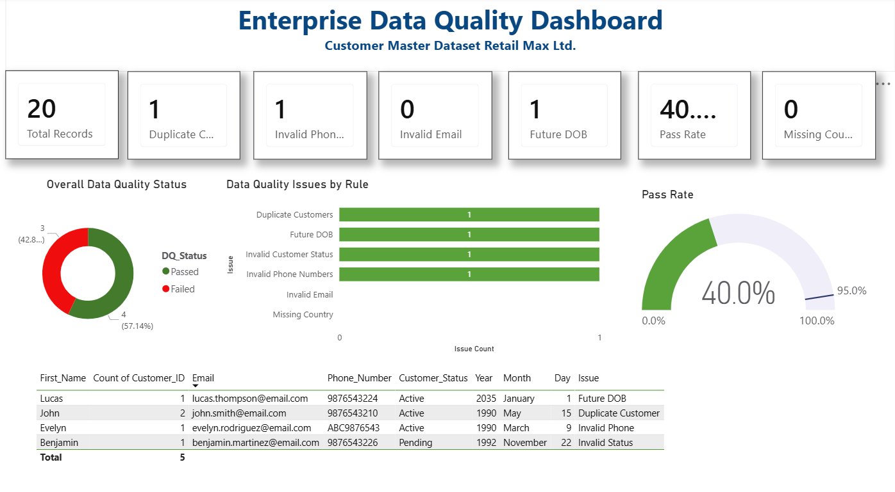

# 🏢 Enterprise Data Governance & Data Quality Framework



## 📖 Overview

This project demonstrates how an organization can design and implement an **Enterprise Data Governance and Data Quality Framework** using a customer master dataset.

The solution combines **Data Governance documentation, SQL-based data quality validation, SQLite, and an executive Power BI dashboard** to identify, monitor, and improve data quality issues across critical customer data.

The project simulates a real-world enterprise data governance initiative and showcases the complete lifecycle from business problem identification to executive reporting.

---

# 🎯 Business Problem

RetailMax Ltd. stores customer information across multiple operational systems.

As the business expanded, inconsistent data entry and the lack of governance resulted in poor quality customer data, including:

- Duplicate customer records
- Invalid phone numbers
- Invalid email addresses
- Future dates of birth
- Missing country values
- Invalid customer status values

Poor data quality can lead to:

- Incorrect business reporting
- Poor customer communication
- Regulatory compliance risks
- Increased operational costs
- Reduced trust in enterprise data

---

# 🚀 Solution Overview

This project demonstrates how these issues can be governed, measured, and monitored through an enterprise Data Governance framework.

```
                 Customer Dataset
                        │
                        ▼
                SQLite Database
                        │
                        ▼
            SQL Data Quality Validation
                        │
                        ▼
         Enterprise Governance Documents
                        │
                        ▼
          Power BI Executive Dashboard
```

---

# 🛠 Technology Stack

| Technology | Purpose |
|------------|---------|
| SQL | Data Quality Validation |
| SQLite | Database |
| Power BI | Executive Dashboard |
| DAX | KPI Calculations |
| Excel | Governance Artifacts |
| Git | Version Control |
| GitHub | Project Repository |

---

# 📂 Repository Structure

```
enterprise-data-governance-data-quality-framework
│
├── database
│   └── RetailMax_DataQuality.db
│
├── datasets
│   ├── sample_data
│   ├── 01_Data_Inventory.xlsx
│   ├── 02_Business_Glossary.xlsx
│   ├── 03_Data_Dictionary.xlsx
│   └── 04_Governance_RACI.xlsx
│
├── docs
│   ├── 01_Business_Problem.md
│   ├── 02_Current_State_Assessment.md
│   ├── 03_Governance_Operating_Model.md
│   ├── 04_Data_Quality_Rules.md
│   ├── 05_Data_Quality_Assessment.md
│   └── 06_Data_Quality_Dashboard.md
│
├── images
│   └── Dashboard_Screenshot.png
│
├── powerbi
│   └── Customer_Data_Quality.pbix
│
├── sql
│   ├── 00_Create_Customer_Database.sql
│   └── 01_Data_Quality_Checks.sql
│
└── README.md
```

---

# 📚 Governance Documentation

The repository includes complete governance documentation similar to what would be created during an enterprise Data Governance implementation.

### Business Problem Statement

Defines the business challenges caused by poor customer data quality.

### Current State Assessment

Evaluates existing data quality maturity and identifies governance gaps.

### Governance Operating Model

Defines:

- Data Owners
- Data Stewards
- Governance Committee
- Escalation Process

### Data Quality Rules

Documents business validation rules for each critical data element.

### Data Quality Assessment

Summarizes findings from SQL validation checks.

### Dashboard Documentation

Explains dashboard KPIs, business metrics, and visualizations.

---

# 📖 Governance Artifacts

The project includes enterprise governance assets such as:

- Data Inventory
- Business Glossary
- Data Dictionary
- Governance RACI Matrix

These documents demonstrate how metadata and governance processes are managed in an enterprise environment.

---

# 🗄 Database

A SQLite Customer Master database is used to simulate enterprise customer records.

Intentional data quality issues were introduced to demonstrate validation techniques.

Example attributes include:

- Customer ID
- First Name
- Last Name
- Email
- Phone Number
- Date of Birth
- Country
- Customer Status

---

# 🔍 SQL Data Quality Checks

The project performs multiple SQL validation checks including:

✅ Duplicate Customers

```sql
SELECT Customer_ID,
       COUNT(*) AS Duplicate_Count
FROM Customer_Master
GROUP BY Customer_ID
HAVING COUNT(*) > 1;
```

---

✅ Missing Email

```sql
SELECT *
FROM Customer_Master
WHERE Email IS NULL
OR TRIM(Email)='';
```

---

✅ Invalid Email Format

```sql
SELECT *
FROM Customer_Master
WHERE Email NOT LIKE '%@%.%';
```

---

✅ Invalid Phone Numbers

Checks:

- Non-numeric characters
- Less than 10 digits
- Greater than 15 digits

---

✅ Future Date of Birth

```sql
SELECT *
FROM Customer_Master
WHERE Date(Date_of_Birth) > Date('now');
```

---

✅ Missing Country

```sql
SELECT *
FROM Customer_Master
WHERE Country IS NULL
OR TRIM(Country)='';
```

---

✅ Invalid Customer Status

Checks whether status belongs to approved business values.

---

# 📊 Power BI Dashboard

The dashboard provides an executive summary of customer data quality.

## KPI Cards

- Total Records
- Duplicate Customers
- Invalid Phone Numbers
- Invalid Email Addresses
- Future DOB
- Missing Country
- Pass Rate

---

## Dashboard Visualizations

### Overall Data Quality Status

Displays the percentage of passed versus failed data quality checks.

### Data Quality Issues by Rule

Ranks the number of issues detected for each validation rule.

### Pass Rate Gauge

Displays overall data quality percentage against the target threshold.

### Exception Records Table

Lists customer records requiring remediation.

---

# 📈 Key Metrics

| KPI | Description |
|------|-------------|
| Total Records | Total customer records |
| Duplicate Customers | Duplicate Customer IDs |
| Invalid Phone Numbers | Incorrect phone formats |
| Invalid Emails | Invalid email addresses |
| Future DOB | Future birth dates |
| Missing Country | Blank country values |
| Pass Rate | Percentage of successful validation checks |

---

# 💼 Skills Demonstrated

## Data Governance

- Data Governance Framework
- Data Stewardship
- Data Ownership
- Metadata Management
- Governance Documentation
- Data Quality Management

---

## SQL

- GROUP BY
- HAVING
- CASE
- Pattern Matching
- NULL Validation
- Aggregate Functions
- Data Profiling

---

## Power BI

- Dashboard Design
- KPI Reporting
- DAX Measures
- Executive Reporting
- Interactive Visualizations

---

## Data Quality

- Data Profiling
- Data Validation
- Rule-Based Validation
- Data Cleansing Concepts
- Root Cause Identification
- Quality Monitoring

---

# 🎯 Business Benefits

Implementing a Data Governance framework helps organizations:

- Improve data accuracy
- Reduce duplicate records
- Increase reporting confidence
- Improve regulatory compliance
- Support better business decisions
- Increase trust in enterprise data

---

# 🚀 Future Enhancements

Planned improvements include:

- Azure Data Factory Integration
- Microsoft Purview Metadata Scanning
- Collibra Data Catalog
- Automated SQL Validation Jobs
- Power BI Service Deployment
- Data Quality Scorecards
- Role-Based Data Steward Dashboards

---

# 👨‍💻 Author

**Gourav Dutta**

Data Analyst | Data Governance | Data Quality | SQL | Power BI | Business Intelligence

🔗 GitHub: https://github.com/gouravinsights

---

## ⭐ If you found this project useful, consider giving it a Star!

Feedback and suggestions are always welcome.
